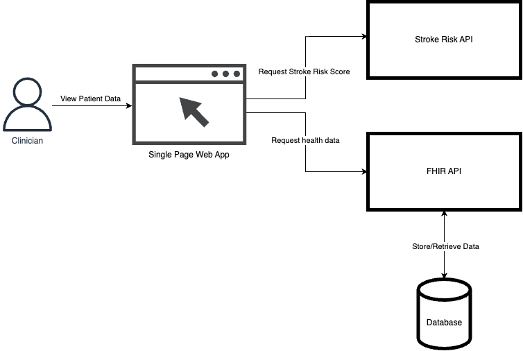

# Architecture Diagram

The following diagram shows the architecture of the application.

The application is made up of three components:

1. HAPI FHIR server
2. ML API
3. Single Page Web App

The FHIR server is used to store patient data. The HAPI FHIR uses a S2 database to persist patient data.

The AI API is used to make stroke risk predictions. The AI API uses scikit-learn to make stroke risk predictions.

The SPA is used to interact with the FHIR server and AI API. The SPA is also used to display the stroke risk prediction. The SPA uses SolidJS to display the patient data and stroke risk prediction.

