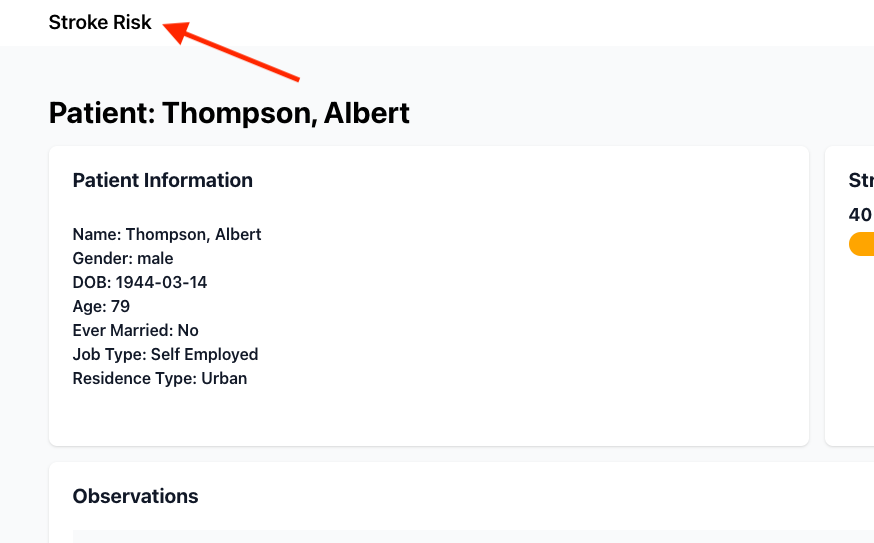

# User Manual

## 1.0 Introduction

This document describes how to use the Stroke Risk Prediction application.

## 2.0 Accessing the Application

The application is hosted on Heroku at https://stroke-score-app.herokuapp.com.

## 3.0 Viewing Patients

The home page of the application displays a list of patients. Click on "View Patient" to view their details.

## 4.0 Viewing Patient Details

The patient details page displays the patient's details and their stroke risk score. The stroke risk score is calculated using the patient's healthcare data and a machine learning model that was trained on existing stroke related healthcare data.

## 5.0 Understanding the Stroke Risk Score

The stroke risk score is a number between 0 and 100. The closer the score is to 100, the higher the risk of the patient having a stroke.

## 6.0 Returning to the Patient List

Click the "Stoke Risk" logo on the top left to return to the patient list.

## 7.0 Test Data

The application is pre-populated with test data to demonstrate a variety of scenarios and patient data. The test data includes:

- A patient with a high stroke risk score (https://stroke-score-app.herokuapp.com/4)
- A patient with a moderate stroke risk score (https://stroke-score-app.herokuapp.com/5)
- A patient with a low stroke risk score (https://stroke-score-app.herokuapp.com/6)